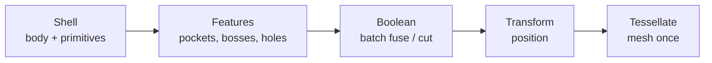

# Composing Complex Parts

The other pages cover the _pieces_ — primitives, topology, booleans, the CSG IR. This page is the _assembly_: how to turn dozens of primitives into one part without writing slow or unmaintainable code.

One rule drives everything here: **collect every operand first, then commit the booleans in batch.** The mistake almost everyone makes first is fusing and cutting one feature at a time.

## The shape of a part build

Nearly every part runs through the same phases:



**Boolean** and **Tessellate** are the phases that allocate kernel geometry, and a B-Rep boolean is expensive — it intersects every face against every face and rebuilds the topology. So the whole game is: fewer, larger booleans, and mesh exactly once.

## Accumulate, then commit

The naive build grows one solid in a loop — N features, N booleans, N intermediate solids:

```typescript
let brick = box(W, D, H);
for (const stud of studs) brick = unwrap(fuse(brick, stud)); // each call rebuilds the topology
```

Instead, push operands into arrays and commit with the N-ary booleans. `fuseAll` unions a flat list; `cutAll` subtracts a list of tools from a base. Each runs as a single native kernel pass, not N pairwise ones. That's how the playground's default part is written:

```typescript
function studBrick(studsX: number, studsY: number, plateUnits: number) {
  const pitch = 8,
    studR = 2.4,
    studH = 1.8,
    plateH = 3.2,
    wall = 1.6;
  const tubeR = 3.255; // anti-stud tube OD = 8√2 − 4.8 = 6.51
  const [W, D, H] = [studsX * pitch, studsY * pitch, plateUnits * plateH];
  const opts = { trackEvolution: false };

  // Collect — no booleans yet.
  const studs = [],
    tubeOuters = [],
    tubeInners = [];
  for (let i = 0; i < studsX; i++)
    for (let j = 0; j < studsY; j++)
      studs.push(cylinder(studR, studH, { at: [i * pitch + pitch / 2, j * pitch + pitch / 2, H] }));
  for (let i = 1; i < studsX; i++)
    for (let j = 1; j < studsY; j++) {
      tubeOuters.push(cylinder(tubeR, H - wall, { at: [i * pitch, j * pitch, 0] }));
      tubeInners.push(cylinder(studR, H - wall, { at: [i * pitch, j * pitch, 0] }));
    }

  // Commit — three batched booleans, not one per feature.
  const body = unwrap(fuseAll([box(W, D, H), ...studs], opts));
  const cavity = box(W - 2 * wall, D - 2 * wall, H - wall, { at: [W / 2, D / 2, (H - wall) / 2] });
  const negativeSpace =
    tubeOuters.length === 0 ? [cavity] : [unwrap(cutAll(cavity, tubeOuters, opts)), ...tubeInners];
  const brick = unwrap(cutAll(body, negativeSpace, opts));

  // Finish — chamfer every stud rim, selected by geometry.
  const rims = edgeFinder().ofCurveType('CIRCLE').findAll(brick);
  return unwrap(chamfer(brick, rims, 0.2));
}
```

::: tip Canonical source
The full version is the playground default in `apps/playground/src/lib/constants.ts` — open the **Stud brick** example and change the three arguments.
:::

The win is structural: an `8×8` baseplate is 64 studs and 49 tube pairs — over 160 booleans one at a time, but always **three** batched. The batched count is constant in part size; the naive count grows with it.

## `trackEvolution: false`

By default a boolean propagates provenance from its inputs to the result so [finders and stable references](/concepts/stable-references) can follow a face across it — bookkeeping you only need when a _later_ step selects geometry by a reference carried from _before_ the boolean. `studBrick` re-selects the rims geometrically (`ofCurveType('CIRCLE')`), so it turns tracking off everywhere.

Keep it on only when a downstream tag or stable reference must survive the boolean. (Note: the batched `fuseAll`/`cutAll` carry origin provenance only — tags and colors are lost across them regardless; use pairwise `fuse`/`cut` if you need them.)

## Builders: one function per feature

When inline loops stop scaling, factor each feature into a **builder** — a pure function returning primitives, touching no shared state and committing no booleans:

```typescript
const buildStuds = (p: BrickParams): Solid[] => {
  /* ... */
};

const part = (p: BrickParams) => {
  const body = unwrap(fuseAll([box(p.W, p.D, p.H), ...buildStuds(p)], { trackEvolution: false }));
  // ... single commit, as before
};
```

Builders return geometry instead of mutating a solid, so they compose freely, test in isolation (assert on count and bounds, no booleans), and keep the expensive commit in one place.

## From script to pipeline

A script with a few builders fits most parts. A configurable generator — features toggling on and off, builds cancelled mid-flight for live preview, per-stage timing — outgrows it. Then promote the phases into a **staged pipeline**: an immutable context threaded through stages, each deciding whether it applies and returning a new context. This is how [`gridfinity-layout-tool`](https://github.com/andymai/gridfinity-layout-tool) generates bins and baseplates on brepjs:

```typescript
interface PipelineContext {
  readonly params: BinParams;
  readonly fuseTargets: readonly Shape3D[]; // accumulated, not yet committed
  readonly cutTargets: readonly Shape3D[];
  readonly solid: Shape3D | null; // set by the Boolean stage
  readonly mesh: MeshData | null; // set by the Tessellate stage
  readonly signal?: AbortSignal;
}

interface PipelineStage {
  readonly name: string;
  shouldRun(ctx: PipelineContext): boolean;
  execute(ctx: PipelineContext): PipelineContext; // ctx in → ctx out, never mutate
}

function runPipeline(stages: readonly PipelineStage[], initial: PipelineContext): PipelineContext {
  let ctx = initial;
  for (const stage of stages) {
    if (!stage.shouldRun(ctx)) continue; // feature toggles fall out for free
    ctx.signal?.throwIfAborted(); // cancellable live preview
    ctx = stage.execute(ctx);
  }
  return ctx;
}
```

The discipline is the same: Shell and Features only push into `fuseTargets`/`cutTargets`; the Boolean stage is the _only_ one that commits; Tessellate runs once. Builders can't accidentally trigger a boolean. The staged form turns three things into free data: `shouldRun` makes feature flags declarative, `signal` makes a slider drag abandon a stale build, and wrapping `execute` in a timer profiles which phase costs what.

You don't need this for a bracket. You need it when the part is a product surface with options.

## Where this fits

None of this is new API — `fuseAll`/`cutAll`, `edgeFinder`, `chamfer`, `mesh` are the same functions documented elsewhere. It's orthogonal to the [CSG IR](/concepts/csg-ir): the IR is the front-end when one tree is re-evaluated with changing parameters; accumulate-then-commit is how you structure a single build, IR or eager.

## Next steps

- **[Boolean Operations](/tasks/booleans)** — `fuseAll`/`cutAll`, `BooleanOptions`, and when a boolean fails.
- **[Stable References](/concepts/stable-references)** — what evolution tracking buys, and when to keep it on.
- **[Parametric CSG walkthrough](/tasks/parametric-csg)** — the same bin built as a cached IR tree.
- **[Performance](/advanced/performance)** — instancing, mesh LODs, and other large-assembly knobs.
