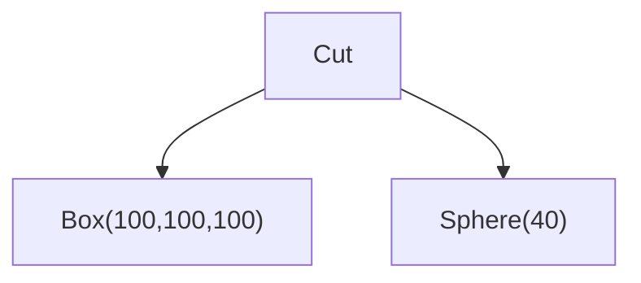
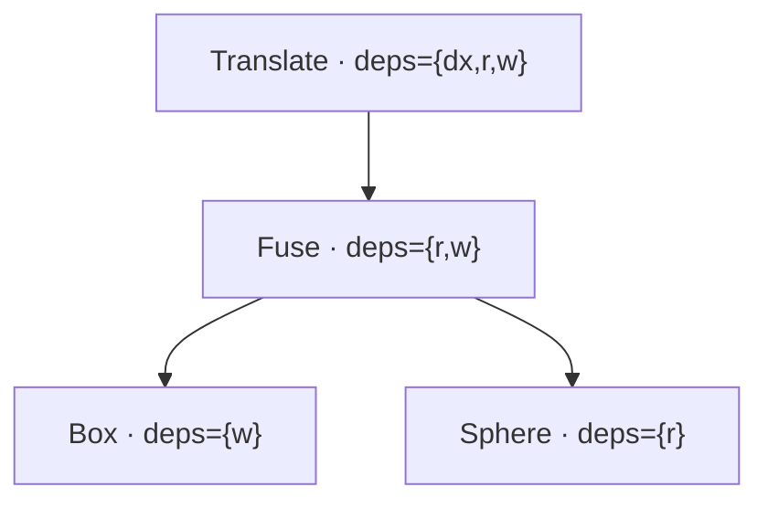

# CSG as an Intermediate Representation

Most code-CAD libraries hand you eager geometry: `box(10, 10, 10)` immediately calls into the kernel, returns a real B-Rep solid, and that solid sits in WASM memory until you `.delete()` it. Chain a few operations and you've allocated and freed dozens of intermediate shapes whose only purpose was to feed the next call.

brepjs's `csg` namespace offers a different surface for the same operations. Instead of materializing geometry, the builders construct a **content-addressed DAG** — a tree of `IRNode` values, each describing what to build without actually building it. Geometry is produced on demand by an `Evaluator`, which caches by structural hash so re-evaluating the same subtree is free.

## A tree, not a shape

Every builder returns a plain data object:

```typescript
import { csg } from 'brepjs/quick';

const node = csg.box(10, 20, 30);
// {
//   kind: 'Box',
//   x: NumLitExpr(10), y: NumLitExpr(20), z: NumLitExpr(30),
//   structuralHash: 0x9f3a...n,
//   freeParams: Set(0) {},
// }
```

No kernel call, no WASM allocation. Same for every builder — `cylinder`, `sphere`, `fuse`, `cut`, `translate`, even `compound`. The tree is just description.

```typescript
import { csg } from 'brepjs/quick';

const tree = csg.cut(csg.box(100, 100, 100), csg.sphere(40));
// kind: 'Cut'
//   a: kind: 'Box' (100×100×100)
//   b: kind: 'Sphere' (radius 40)
```



The structure of the tree is the structure of the computation. Nothing has been computed yet.

## Content-addressed hashing

Every node carries a `structuralHash` — a 64-bit FNV-1a Merkle hash of its kind plus its children's hashes. Two trees that describe the _same_ geometry hash identically, regardless of how they were built:

```typescript
import { csg } from 'brepjs/quick';

const a = csg.fuse(csg.box(10, 10, 10), csg.sphere(5));
const b = csg.fuse(csg.box(10, 10, 10), csg.sphere(5));

a.structuralHash === b.structuralHash; // true
```

Change _any_ literal anywhere in the tree and the hash changes:

```typescript
csg.box(10, 10, 10).structuralHash === csg.box(10, 10, 11).structuralHash;
// false — last dimension differs
```

The hash is computed once at build time and stored on the node, so cache lookups during evaluation are O(1) per node rather than O(subtree-size). The hash also normalizes `-0` to `+0` and serializes floats bit-exactly via `DataView.setFloat64`, so identical doubles always hash the same.

## Free parameters propagate upward

Builders accept literal numbers or expressions. Expressions parameterize the tree — `csg.param('w')` is a placeholder bound at evaluation time. Each node tracks the set of parameter names it transitively depends on:

```typescript
import { csg } from 'brepjs/quick';

const tree = csg.translate(csg.fuse(csg.box(csg.param('w'), 10, 10), csg.sphere(csg.param('r'))), [
  csg.param('dx'),
  0,
  0,
]);

[...tree.freeParams].sort(); // ['dx', 'r', 'w']
```

`freeParams` is computed bottom-up by the builders at build time. The evaluator uses it to project the env before computing the cache key — a node that doesn't reference `dx` will never see `dx` enter its cache key, so unrelated env edits cannot invalidate it. This is the core mechanism behind incremental re-evaluation:



When `dx` changes, only `Translate` invalidates. When `r` changes, `Sphere` + `Fuse` + `Translate` invalidate but `Box` survives. The granularity is structural: the cost of a parameter edit is proportional to the size of the subtrees that depend on it, not the size of the whole tree.

## Output kinds and structural validity

The IR doesn't have separate node types for solids vs faces vs edges — there's one `IRNode` union with a `kind` discriminator. Output kind is derived structurally via `outputKindOf`:

```typescript
import { csg } from 'brepjs/quick';

csg.outputKindOf(csg.box(10, 10, 10)); // 'Solid'
csg.outputKindOf(csg.translate(csg.box(10, 10, 10), [1, 0, 0])); // 'Solid'
csg.outputKindOf(csg.cut(csg.box(10, 10, 10), csg.sphere(3))); // 'Solid'
csg.outputKindOf(csg.circle(5)); // 'Edge'
csg.outputKindOf(
  csg.polygon([
    [0, 0, 0],
    [1, 0, 0],
    [0, 1, 0],
  ])
); // 'Face'
```

Booleans inherit the kind of their `a` argument; transforms inherit from `target`; primitives are fixed. There's no cross-kind boolean — `fuse(box, circle)` is rejected at the kernel boundary, not by the TypeScript types at v1.

## Two equivalent ways to compute the same geometry

Both snippets produce the same 1000 - π·125 ≈ 477 mm³ solid:

::: code-group

```typescript [Eager — topology API]
import { box, sphere, cut, measureVolume, unwrap } from 'brepjs/quick';

const cube = box(10, 10, 10);
const ball = sphere(2.5);
const part = unwrap(cut(cube, ball));
const v = unwrap(measureVolume(part));
// 3 kernel allocations: cube, ball, part — all live until disposed
```

```typescript [CSG IR]
import { csg, measureVolume, unwrap } from 'brepjs/quick';

const tree = csg.cut(csg.box(10, 10, 10), csg.sphere(2.5));
using ev = new csg.Evaluator();
const v = unwrap(measureVolume(unwrap(ev.evaluate(tree))));
// 3 kernel allocations the first time. 0 on every subsequent ev.evaluate(tree).
```

:::

The eager API is the right answer when you build a part once. The IR is the right answer when:

- the same tree shape gets re-evaluated with different parameter bindings (slider UIs, optimizer sweeps),
- multiple branches of a build share common subtrees that would otherwise be recomputed,
- you want to serialize the build recipe to JSON without serializing materialized B-Rep data,
- you want to inspect, simplify, or edit the build graph before evaluation.

If none of those apply, the topology API is leaner. The IR is a tool, not a replacement.

## Where this fits in brepjs

The IR is purely a build-time abstraction layered on top of the kernel adapter — `csg.Evaluator` calls the same `getKernel().fuseSolids(...)` that the topology API does. Everything that works on a `Solid` works on the result of `ev.evaluate(tree)`: finders, fillets, measurement, export. The IR is the parametric _front_ of the pipeline; the topology API picks up where it leaves off.

## The rest of the surface

The examples above touch `box`, `sphere`, `cylinder`, `cut`, `fuse`, and `translate`. The full builder set adds `cone`, `torus`, `polygon`, `circle`, `line`, `vertex`, `mirror`, `scale`, `rotate`, `compound`, plus the N-ary booleans `fuseAll` and `cutAll`. Expression helpers include `add`/`mul` shortcuts, `unaryOp` (sin, cos, sqrt, abs, neg), `component` for indexing vectors, and `buildVec` for constructing them from scalars. All exported from `'brepjs'` under the `csg.*` namespace; see the [API reference](https://andymai.github.io/brepjs/) for type signatures.

## Next steps

- **[Parametric CSG walkthrough](/tasks/parametric-csg)** — build a gridfinity-style bin with named parameters, change a slider, watch the cache absorb the unchanged subtrees.
- **[CSG caching internals](/advanced/csg-caching)** — `cacheStats`, `optimize`, serialization, what the cache key actually contains, and what _doesn't_ cache.
- **[Migrating from a hand-rolled cache](/migration/manual-csg-cache)** — if you've built your own `Map<key, Solid>` cache around eager geometry, here's the IR equivalent and what you'd inherit by switching.
