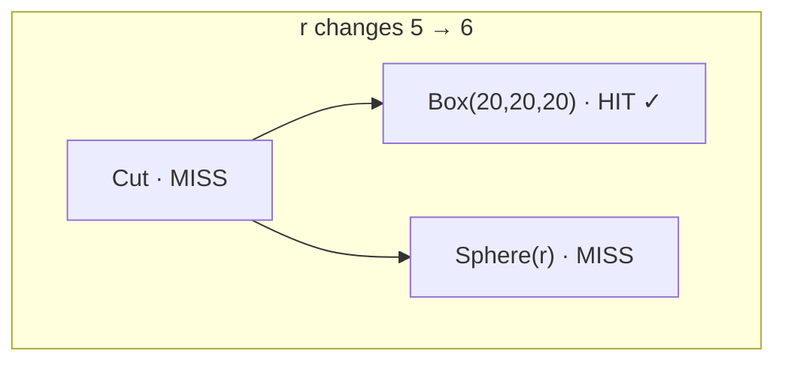

# Migrating from a Hand-Rolled Cache

A common pattern in code-CAD apps: wrap the eager `box`/`fuse`/`cut` API in a `Map<string, Solid>` keyed by the input parameters, so re-renders during a slider drag don't recompute identical geometry. It works, but it has rough edges: every cache key is hand-derived, invalidation is all-or-nothing per top-level entry, and you own a `.delete()` lifecycle that's easy to leak.

The `csg` namespace gives you the same caching semantics without the bookkeeping.

If you haven't read **[CSG as an IR](/concepts/csg-ir)** yet, do that first. This page focuses on the diff, not the model.

## The scenario

A live-preview UI lets the user tweak the radius of a hole drilled through a fixed-size cube. The naive eager version recomputes everything on every slider event; the manual-cache version memoizes by stringified parameters; the IR version replaces the cache plumbing entirely.

## Version A: eager, no cache

```typescript
import { box, sphere, cut, unwrap, measureVolume } from 'brepjs/quick';

function makePart(r: number) {
  const cube = box(20, 20, 20);
  const ball = sphere(r);
  return unwrap(cut(cube, ball));
}

// onSliderChange:
const part = makePart(slider.value);
const v = unwrap(measureVolume(part));
```

Every slider event allocates one new cube, one new sphere, one new cut: three live B-Rep solids in WASM memory. The cube has nothing to do with the slider but gets rebuilt anyway. Repeat 30× per second during a drag and you're allocating a thousand intermediate handles a minute.

## Version B: manual `Map` cache

Most projects converge on this pattern once Version A's allocation rate shows up in the profiler. Keys are stringified parameters, values are materialized solids, and you carry an explicit dispose path because the cache owns the handles.

```typescript
import { box, sphere, cut, unwrap, measureVolume } from 'brepjs/quick';
import type { Solid } from 'brepjs';

const cubeCache = new Map<string, Solid>();
const sphereCache = new Map<string, Solid>();
const partCache = new Map<string, Solid>();

function cachedCube(L: number, W: number, H: number): Solid {
  const key = `${L},${W},${H}`;
  let s = cubeCache.get(key);
  if (!s) {
    s = box(L, W, H);
    cubeCache.set(key, s);
  }
  return s;
}

function cachedSphere(r: number): Solid {
  const key = `${r}`;
  let s = sphereCache.get(key);
  if (!s) {
    s = sphere(r);
    sphereCache.set(key, s);
  }
  return s;
}

function cachedPart(r: number): Solid {
  const key = `cube20_sphere${r}`;
  let s = partCache.get(key);
  if (!s) {
    s = unwrap(cut(cachedCube(20, 20, 20), cachedSphere(r)));
    partCache.set(key, s);
  }
  return s;
}

// onSliderChange:
const part = cachedPart(slider.value);
const v = unwrap(measureVolume(part));

// On unmount: dispose everything (don't forget any cache!)
for (const s of [...cubeCache.values(), ...sphereCache.values(), ...partCache.values()]) {
  s[Symbol.dispose]();
}
```

This works, but look at what it costs:

1. **One cache per primitive plus one per composite.** Three caches here; add a fillet, a translate, and a fuse and you're up to six.
2. **Manual key derivation.** `${L},${W},${H}` works until floats need precision normalization, until you forget to include the tolerance, until you add a parameter and miss a key site.
3. **Manual invalidation.** Change the cube size and you need to know which composite cache entries depended on it. The cache structure doesn't capture the dependency graph; you do.
4. **Lifetime is your problem.** Every cache entry is a live kernel handle. Forget to dispose one cache on unmount → leak. Dispose twice → kernel error.
5. **Edges of the cache key.** Did you remember the kernel id? The boolean tolerance? Two evaluators with different tolerance settings should not share entries; but the manual cache happily returns the wrong shape if you don't think to include it in the key.

Each one is solvable individually, but each one is also a place where the next engineer to touch the file makes a subtle mistake. The CSG IR makes the whole class go away.

## Version C: CSG IR

```typescript
import { csg, unwrap, measureVolume } from 'brepjs/quick';

const tree = csg.cut(csg.box(20, 20, 20), csg.sphere(csg.param('r')));

using ev = new csg.Evaluator();

// onSliderChange:
const shape = unwrap(ev.evaluate(tree, { r: slider.value }));
const v = unwrap(measureVolume(shape));
```

That's the whole file. Compare what disappeared:

- **Three caches collapsed into one.** The evaluator caches every node by structural hash, so the cube, the sphere, and the cut each get their own entry automatically.
- **No string keys.** The cache key is `(structuralHash, kernelId, projectedEnvHash, toleranceHash)`, derived from the tree, not from your formatting choices. Floats are hashed bit-exactly via `DataView.setFloat64` with `-0` normalized; the kernel id is captured at evaluator construction; tolerance is a first-class field.
- **Invalidation is automatic and granular.** When `r` changes, only the sphere and the cut invalidate. The cube hits the cache because `r` isn't in its `freeParams`. You didn't have to think about which composites depend on which primitives.
- **Lifetime is structural.** `using ev = new csg.Evaluator()` releases every cached handle when the block exits. No per-cache iteration, no risk of double-dispose, no risk of partial cleanup.

The behavior on a slider drag, which is what you actually care about:



The cube subtree hits; only the sphere re-materializes and the cut recomputes. Same end-to-end as Version B, without the bookkeeping surface area.

## What you inherit by switching

A few things the IR gives you on top of the cache that the manual version doesn't have:

- **`csg.optimize(tree)`**: pure tree rewrites: constant folding, identity elimination, translate fusion. Run once after building; the rest of the session works on a smaller tree. See [CSG caching internals](/advanced/csg-caching#optimize-tree-level-rewrites).
- **`csg.toJSON` / `csg.fromJSON`**: serialize the build recipe to JSON. The deserialized tree shares cache entries with the original because structural hashes are reconstructed correctly. Useful for build pipelines, undo/redo snapshots, or sharing models without shipping STEP files.
- **`csg.replaceNode`**: swap a subtree by predicate. The rebuild walks bottom-up via builders so hashes stay correct.
- **`onStep` instrumentation**: install a callback to trace every cache hit/miss per node. The thing you want when the profiler says "still too slow" and you need to know which subtree's cache key keeps changing.

The manual version can grow all of these; but each one is its own subsystem in your codebase that the IR gives you in 50 lines.

## When the manual cache is still the right answer

Switching costs aren't zero. Stay on the manual cache when:

- **Your tree never changes shape, only inputs.** If the user can only resize a single primitive (no add/remove features, no swap operations, no per-feature toggles), Version B's three-line `cachedFoo` wrappers are easy to skim and your team already understands them.
- **You need an eviction _policy_ the built-in LRU doesn't express.** The CSG cache is unbounded by default, but you can cap it: pass `maxCacheEntries` for an LRU bound on materialized shapes and `maxMeshCacheEntries` for the independent mesh cache (eviction disposes the evicted kernel handles for you — see [Bounding the cache](/advanced/csg-caching#bounding-the-cache)). If you need something LRU can't express — pinning specific entries hot regardless of recency, or a cost-weighted policy — a hand-rolled cache still gives you that.
- **You're integrating with code that already speaks `Solid`.** The manual cache returns `Solid` values directly; the IR returns them through `ev.evaluate(node, env)`. Adapting the call sites can be more work than the win for a small project.

For the gridfinity-style live-preview case (slider drag rebuilds a multi-feature parametric tree) the IR wins decisively. For a one-shot CAD batch where you build, export, and exit, neither cache matters.

## Migration checklist

If you've decided to migrate:

1. **Translate primitives.** `box(...)` → `csg.box(...)`, `sphere(...)` → `csg.sphere(...)`, etc. Same arguments. The return type changes from `Solid` to `SolidNode`.
2. **Translate composites.** `unwrap(cut(a, b))` → `csg.cut(aNode, bNode)`. Same for `fuse`, `intersect`. No `unwrap`. The IR builders never fail.
3. **Translate transforms.** `translate(s, [x,y,z])` → `csg.translate(node, [x,y,z])`. Same for `rotate`, `scale`, `mirror`. Note that `csg.rotate` takes its axis/anchor via an options object, not positional args.
4. **Wrap with an evaluator.** `using ev = new csg.Evaluator()` once at the top of your render loop, then `unwrap(ev.evaluate(tree))` (or with `env` for parametric trees) at each render.
5. **Drop the cache plumbing.** Remove your `Map<string, Solid>` declarations, your stringified-key helpers, and your `dispose-all-on-unmount` loops. The `using` keyword on the evaluator handles the lifetime.
6. **Drop the per-call unwraps that no longer apply.** Builders return nodes directly; only `evaluate` returns `Result`.

End state: a single tree built once, a single evaluator reused across renders. A few-hundred-line manual cache file usually shrinks to a few dozen.

## See also

- **[CSG as an IR](/concepts/csg-ir)**: the mental model this migration assumes you have.
- **[The walkthrough](/tasks/parametric-csg)**: a multi-parameter gridfinity-style bin if you want a fuller example before committing to a migration.
- **[CSG caching internals](/advanced/csg-caching)**: for the full surface of the IR you're inheriting.
