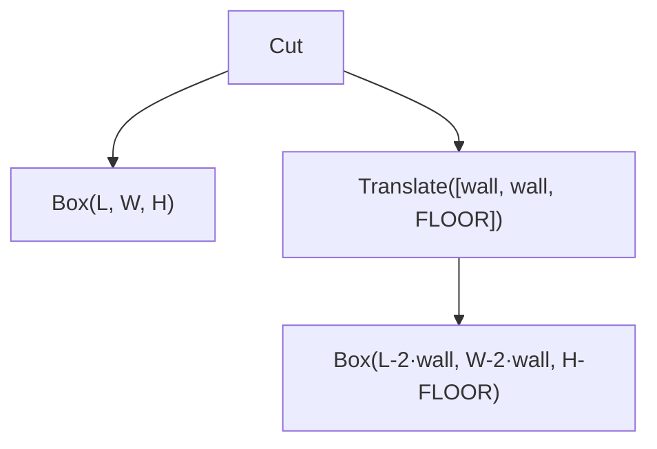

# Parametric CSG: a Gridfinity-Style Bin

This walkthrough builds a simplified gridfinity-style bin (an outer block with a pocket cut from the top) using `csg` builders and named parameters. By the end you'll have a tree you can re-evaluate with different parameter values, and you'll see directly how the evaluator's cache spares the unchanged subtrees.

If you haven't read **[CSG as an IR](/concepts/csg-ir)** yet, do that first. This page assumes you already know that builders return data, not geometry.

## The shape we're building

Think of a single gridfinity-compatible bin as two pieces:

- an **outer block** of size `L × W × H`,
- a **pocket** centered inside it, inset by `wall` on the four sides and `floor` on the bottom.

The pocket gets cut from the outer block. We'll skip the base lips, magnet holes, and label tabs; they distract from the point of this page, which is the parameterization.

Real-world gridfinity dimensions: `L = W = 42 mm`, `H = 30 mm`, `wall = 1.2 mm`, `floor = 1.5 mm`.

## Step 1: Pick what's parametric

A live-preview UI lets the user drag sliders for length, width, height, and wall thickness; floor thickness is fixed. So `L`, `W`, `H`, and `wall` get `csg.param()` calls; `floor` is a literal.

A subtle but important detail: **`wall` is a separate parameter, not derived from `L`**. If the pocket dimensions were `L - 2*wall` for a hard-coded wall, changing `L` would invalidate every subtree that touched the pocket. By making `wall` its own parameter, the outer box only depends on `{L, W, H}` and survives wall-thickness edits untouched. This is the kind of decision the IR's cache structure rewards, worth thinking about up front.

## Step 2: Write the builder

```typescript
import { csg } from 'brepjs/quick';

const FLOOR = 1.5;

function bin(L: csg.Expr, W: csg.Expr, H: csg.Expr, wall: csg.Expr): csg.SolidNode {
  const outer = csg.box(L, W, H);

  const innerL = csg.binOp('-', L, csg.binOp('*', csg.numLit(2), wall));
  const innerW = csg.binOp('-', W, csg.binOp('*', csg.numLit(2), wall));
  const innerH = csg.binOp('-', H, csg.numLit(FLOOR));

  const pocket = csg.translate(csg.box(innerL, innerW, innerH), [wall, wall, FLOOR]);

  return csg.cut(outer, pocket);
}
```

Two things to notice:

1. **Expression arithmetic is explicit.** `csg.binOp('-', L, ...)` is verbose compared to `L - 2*wall`, but that's the price of keeping the math in the IR. The subtraction is part of the tree and gets folded by `optimize()` when its operands turn into literals. There's no operator overloading in TypeScript, so this is as ergonomic as it gets. For the two common cases, `csg.add(a, b)` and `csg.mul(a, b)` are shortcuts for `binOp('+', ...)` and `binOp('*', ...)`; subtraction and division still need the full form.
2. **Type narrowing falls out for free.** `csg.box` always returns a `SolidNode`, `csg.cut` of two solids returns a solid, and the function signature says so. You don't lose the "I know this is a solid" knowledge crossing into the IR.

The resulting tree:



## Step 3: Build the tree and evaluate it

Create the parametric tree once, then evaluate it with an env binding:

```typescript
import { csg, measureVolume, unwrap } from 'brepjs/quick';

const tree = bin(csg.param('L'), csg.param('W'), csg.param('H'), csg.param('wall'));

[...tree.freeParams].sort();
// ['H', 'L', 'W', 'wall']

using ev = new csg.Evaluator();
const shape = unwrap(ev.evaluate(tree, { L: 42, W: 42, H: 30, wall: 1.2 }));
const volume = unwrap(measureVolume(shape));
// outer (42·42·30) − pocket ((42−2.4)·(42−2.4)·(30−1.5)) ≈ 8227 mm³
```

A few subtleties worth flagging:

- **`using ev = new csg.Evaluator()`**: `Evaluator` is a `Disposable`. The `using` keyword (TypeScript 5.2+) ensures the evaluator's cached shapes are released when the block exits. If you're targeting an older runtime, call `ev[Symbol.dispose]()` manually in a `finally`.
- **`ev.evaluate(tree, env)` returns `Result<AnyShape>`**: `unwrap` throws on error. In production code, prefer `isOk(r)` and explicit handling. See [Result\<T,E\> and Errors](/concepts/result).
- **The returned shape is borrowed.** It lives until the evaluator is disposed. Do NOT call `[Symbol.dispose]()` on it directly; that would corrupt the cache for the next call returning the same handle.

## Step 4: Edit a parameter

The reason to put work into the IR upfront is moments like this:

```typescript
ev.resetStats();
const taller = unwrap(ev.evaluate(tree, { L: 42, W: 42, H: 42, wall: 1.2 }));
ev.cacheStats();
// { hits: 0, misses: 4, entries: 8 }
```

Every subtree references `H` (outer box directly, inner box as `H - FLOOR`, translate and cut transitively), so every cache key changes. Four misses. The cache holds eight entries: four for `H = 30`, four for `H = 42`.

Now change `wall` instead:

```typescript
ev.resetStats();
unwrap(ev.evaluate(tree, { L: 42, W: 42, H: 42, wall: 2.0 }));
ev.cacheStats();
// { hits: 1, misses: 3, entries: 11 }
```

One hit. The outer `Box(L, W, H)` only depends on `{L, W, H}`; `wall` isn't in its `freeParams`, so its cache key is unchanged. The pocket box, the translate, and the cut all depend on `wall` and miss. Three new misses, eleven entries total.

In a live-preview UI, this is the difference between "drag the wall slider → entire bin re-renders" and "drag the wall slider → only the pocket subtree re-renders." On non-trivial models with dozens of features, that ratio matters a lot.

## Step 5: Unrelated env keys are free

The evaluator projects the env to only the keys a node actually depends on, so you can stuff debug tags, UI state, or anything else into the env without invalidating anything:

```typescript
ev.evaluate(tree, { L: 42, W: 42, H: 30, wall: 1.2, sliderTouched: 'L' });
ev.resetStats();
ev.evaluate(tree, { L: 42, W: 42, H: 30, wall: 1.2, sliderTouched: 'wall' });
ev.cacheStats();
// { hits: 4, misses: 0, entries: 11 }
```

No node has `sliderTouched` in its `freeParams`, so no cache key changes; everything hits. Wire the env directly to your application state; no filtering required.

## When you don't need the cache across calls

If you only want to evaluate a tree once and let everything get disposed when you're done, `withEvaluator` handles the lifecycle:

```typescript
import { csg, measureVolume, unwrap } from 'brepjs/quick';

const volume = csg.withEvaluator({}, (ev) => {
  const shape = unwrap(ev.evaluate(csg.box(10, 10, 10)));
  return unwrap(measureVolume(shape));
});
// Evaluator disposed at function exit; volume is a primitive that escapes safely.
```

`withEvaluator` is **sync-only**. If your callback returns a `Promise`, the evaluator disposes before the promise resolves and any borrowed shapes point at freed WASM memory. The runtime throws if you try.

## Errors you'll hit and how to read them

A few things will reliably trip the evaluator:

```typescript
import { csg, isErr } from 'brepjs/quick';

// 1. Forgetting to bind a param
using ev = new csg.Evaluator();
const r1 = ev.evaluate(csg.box(csg.param('missing'), 10, 10), {});
isErr(r1); // true - "unbound param: missing"

// 2. Evaluating an Empty alone (it has no kernel realization)
const r2 = ev.evaluate(csg.emptySolid());
isErr(r2); // true

// 3. Cut(empty, x) - empty has nothing for the kernel to subtract from
const r3 = ev.evaluate(csg.cut(csg.emptySolid(), csg.box(1, 1, 1)));
isErr(r3); // true
```

`fuse(empty, x)` _does_ work; it short-circuits to `x` directly without calling the kernel's union. `Empty` nodes exist as the identity element of `optimize()`'s simplifications; they're meant to disappear before evaluation.

## Where to go next

- **[CSG caching internals](/advanced/csg-caching)**: `cacheStats`, what's in the cache key, when to call `optimize()`, JSON round-trip, and tree-editing primitives like `replaceNode`.
- **[Migrating from a hand-rolled cache](/migration/manual-csg-cache)**: if you've already built `Map<key, Solid>` plumbing around the eager API, here's the side-by-side translation.
- **[The eager topology API](/tasks/booleans)**: when you build a single part and don't need re-evaluation, plain `fuse`/`cut`/`intersect` is leaner.
