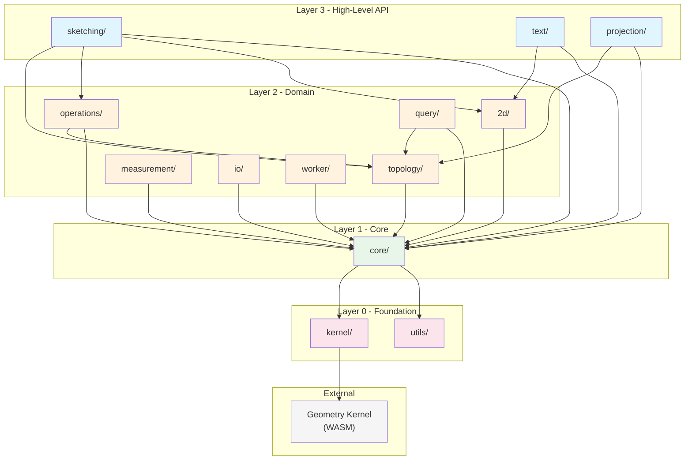
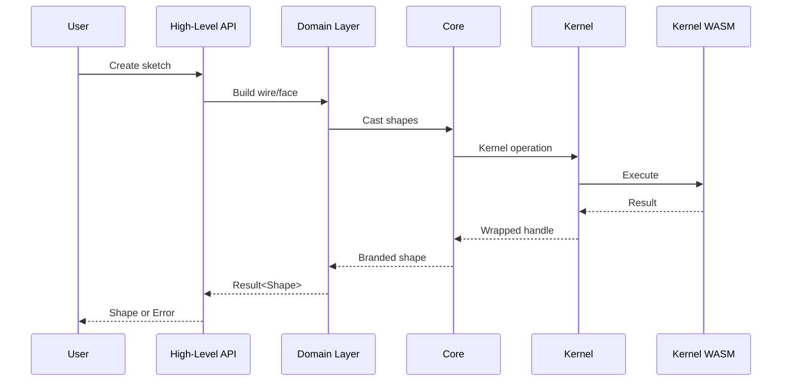

# Architecture

Four layers, imports flow downward only, boundaries enforced in CI.

## Layer Diagram



## Layers

### Layer 0: Foundation

No internal imports allowed.

| Module    | Purpose                                                                                                 |
| --------- | ------------------------------------------------------------------------------------------------------- |
| `kernel/` | Kernel adapter interface + adapters for OpenCascade (`brepjs-opencascade`) and brepkit (`brepkit-wasm`) |
| `utils/`  | Pure utilities (no dependencies)                                                                        |

### Layer 1: Core

Imports kernel/utils only.

| Module  | Purpose                                                       |
| ------- | ------------------------------------------------------------- |
| `core/` | Memory management, types, geometry primitives, error handling |

### Layer 2: Domain

Imports layers 0-1 and each other.

| Module         | Purpose                                                   |
| -------------- | --------------------------------------------------------- |
| `topology/`    | Shape classes, boolean operations, casting                |
| `operations/`  | Extrusion, loft, sweep, batch operations                  |
| `2d/`          | Blueprints, curves, 2D operations                         |
| `query/`       | Shape finders (face, edge, corner)                        |
| `measurement/` | Volume, area, length, distance                            |
| `io/`          | Import/export (STEP, STL, IGES, SVG, glTF, DXF, 3MF, OBJ) |
| `worker/`      | Off-main-thread worker protocol                           |

### Layer 3: High-Level API

Imports all lower layers.

| Module        | Purpose                                 |
| ------------- | --------------------------------------- |
| `sketching/`  | Sketcher API, sketch-to-shape workflows |
| `text/`       | Text blueprints from fonts              |
| `projection/` | Camera and projection utilities         |

## Data Flow



## Key Patterns

### 1. Functional API

brepjs uses an immutable functional API:

```typescript
const myBox = box(10, 10, 10);
const moved = translate(myBox, [5, 0, 0]); // Returns new shape
```

### 2. Result Types

All fallible operations return `Result<T, BrepError>`:

```typescript
const result = fuse(a, b);
if (isOk(result)) {
  // result.value is the fused shape
}
```

### 3. Branded Types

Shapes use branded types for type safety:

```typescript
declare const __brand: unique symbol;
type Solid = ShapeHandle & { readonly [__brand]: 'solid' };
type Face<D extends Dimension = '3D'> = ShapeHandle & { readonly [__brand]: 'face'; ... };

// Compiler prevents mixing
function takeSolid(s: Solid) {}
takeSolid(face); // Error: Face not assignable to Solid
```

**Validity brands** add a second layer of compile-time safety:

```typescript
type ClosedWire<D> = Wire<D> & { readonly [__closed]: true };
type OrientedFace<D> = Face<D> & { readonly [__oriented]: true };
type ValidSolid = Solid & { readonly [__valid]: true };

// face() requires ClosedWire - passing a plain Wire is a compile error
function face(wire: ClosedWire): Result<OrientedFace>;
```

See [B-Rep Concepts](./concepts.md#validity-types) for usage patterns.

### 4. Scoped Resource Management

Kernel objects are cleaned up via scopes:

```typescript
using scope = new DisposalScope();
const temp = scope.register(someKernelHelper());
// temp cleaned up when scope exits
```

### 5. Kernel Abstraction

All geometry operations go through `KernelAdapter` (defined in `kernel/types.ts`). Layer 2+ code treats shapes as opaque handles - it never calls methods on them directly.

```typescript
// ✅ Correct - pass handle to kernel method
const hash = getKernel().hashCode(shape.wrapped, HASH_CODE_MAX);
const type = getKernel().shapeType(shape.wrapped);

// ❌ Banned - direct method call on handle
const hash = shape.wrapped.HashCode(max);
```

The default kernel implementation delegates to specialized `*Ops.ts` files that contain all raw kernel API calls. A different kernel replaces these files while Layer 2+ code remains unchanged.

See [Custom Kernel Guide](./kernel-swap.md) for writing alternative kernel implementations.

For boundary enforcement details (`check:boundaries`, ESLint rules), see [CONTRIBUTING.md](../CONTRIBUTING.md#layer-boundaries).
