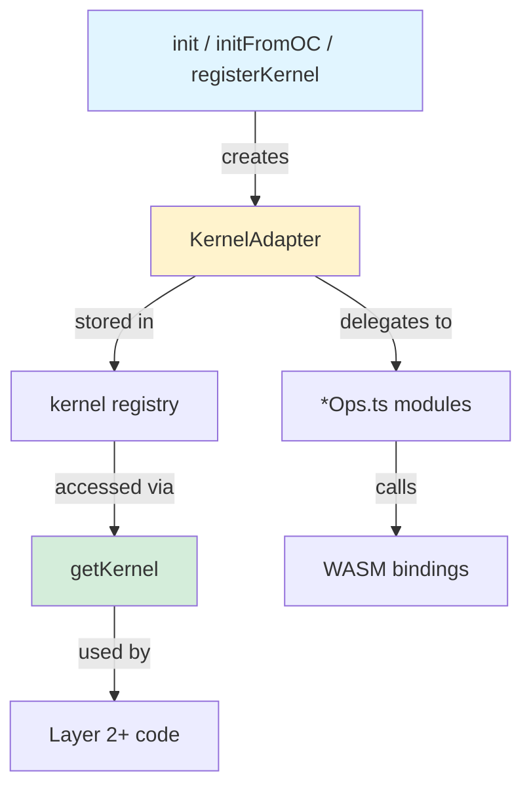

# Kernel

Kernel abstraction layer — all geometry operations go through `KernelAdapter`, making the library kernel-agnostic. Two adapters are provided: OpenCascade WASM (via the `brepjs-opencascade` companion package) and brepkit WASM (via the external `brepkit-wasm` npm package). Additional kernels can be registered at runtime.



## Architecture

Layer 2+ code **never** calls methods on kernel shape handles. It only:

1. Passes handles to `getKernel().method(shape)` calls
2. Stores handles in branded types' `.wrapped` property

This is enforced by an ESLint `no-restricted-syntax` rule that bans `x.wrapped.method()` calls outside `src/kernel/`.

## Key Files

| File                  | Purpose                                                                                                                           |
| --------------------- | --------------------------------------------------------------------------------------------------------------------------------- |
| `index.ts`            | Kernel registry: `init()`, `getKernel()`, `getKernel2D()`, `registerKernel()`, `withKernel()`, `initFromOC()`                     |
| `types.ts`            | `KernelAdapter` interface (~164 methods), `KernelShape`/`KernelType` opaque handles, `ShapeType`, `BooleanOptions`, `MeshOptions` |
| `kernel2dTypes.ts`    | `Kernel2DCapability` interface (~40 methods) for 2D curve/sketch operations                                                       |
| `defaultAdapter.ts`   | Default OCCT adapter class — thin delegation layer implementing both interfaces                                                   |
| `brepkitAdapter.ts`   | brepkit WASM adapter (`BrepkitAdapter`) — alternative kernel with growing operation coverage                                      |
| `geometry2d.ts`       | Pure-TypeScript 2D geometry engine — kernel-agnostic, used by brepkit and occt-wasm adapters                                      |
| `brepkitWasmTypes.ts` | TypeScript type definitions for the brepkit WASM module                                                                           |

### Operation Modules (kernel-specific)

All raw kernel API calls are isolated in these files. A new kernel replaces `defaultAdapter.ts` and these modules.

| File                        | Purpose                                                                                                                                                         |
| --------------------------- | --------------------------------------------------------------------------------------------------------------------------------------------------------------- |
| `constructorOps.ts`         | `makeVertex`, `makeEdge`, `makeWire`, `makeFace`, `makeBox`, `makeCylinder`, `makeSphere`                                                                       |
| `extendedConstructorOps.ts` | `makeLineEdge`, `makeCircleEdge`, `makeBezierEdge`, `makeHelixWire`, `makeCompound`, `solidFromShell`, `toBREP`, `fromBREP`, `dispose`                          |
| `sweepOps.ts`               | `extrude`, `revolve`, `loft`, `sweep`, `simplePipe`                                                                                                             |
| `modifierOps.ts`            | `fillet`, `chamfer`, `shell`, `thicken`, `offset`, `offsetWire2D`                                                                                               |
| `booleanOps.ts`             | `fuse`, `cut`, `intersect`, `section`, `fuseAll`, `cutAll`, `split`                                                                                             |
| `transformOps.ts`           | `translate`, `rotate`, `mirror`, `scale`, `generalTransform`, `simplify`                                                                                        |
| `measureOps.ts`             | `volume`, `area`, `length`, `centerOfMass`, `boundingBox`, `distance`, `classifyPointOnFace`                                                                    |
| `geometryQueryOps.ts`       | `hashCode`, `isNull`, `shapeType`, `surfaceType`, `vertexPosition`, `curvePointAtParam`, `curveIsClosed`, `curveType`, `reverseShape`, `getSurfaceCylinderData` |
| `meshOps.ts`                | `mesh`, `meshEdges` (C++ bulk extraction via MeshExtractor/EdgeMeshExtractor)                                                                                   |
| `topologyOps.ts`            | `iterShapes`, `iterShapeList`, `isSame`, `isEqual`, `isValid`, `sew`                                                                                            |
| `ioOps.ts`                  | `exportSTEP`, `exportSTL`, `importSTEP`, `importSTL`, `exportIGES`, `importIGES`                                                                                |
| `exportOps.ts`              | `wrapString`, `wrapColorRGBA`, `configureStepUnits`, `configureStepWriter`                                                                                      |
| `historyOps.ts`             | `*WithHistory` variants for all transforms and booleans (face hash tracking)                                                                                    |
| `advancedOps.ts`            | Patterns, XCAF documents, projection, surface construction, curvature                                                                                           |
| `healingOps.ts`             | `healSolid`, `healFace`, `healWire`                                                                                                                             |
| `curveOps.ts`               | `interpolatePoints`, `approximatePoints`                                                                                                                        |
| `evolutionOps.ts`           | `buildEvolution`, `transformWithEvolution`, `booleanWithEvolution`, `modifierWithEvolution` — face-tracking evolution for topology history                      |
| `hullOps.ts`                | `hull`, `hullFromPoints`, `buildSolidFromFaces`                                                                                                                 |
| `kernel2dOps.ts`            | All 2D curve operations: creation, evaluation, transforms, bounding boxes, circle/ellipse/bezier data extraction                                                |

## Kernel Registration

```typescript
// Auto-detect and initialize the best available kernel
import { init } from 'brepjs';
const kernelId = await init(); // 'occt' or 'brepkit'

// Or initialize a specific kernel manually:

// OpenCascade WASM
import opencascade from 'brepjs-opencascade';
import { initFromOC } from 'brepjs';
const oc = await opencascade();
initFromOC(oc);

// brepkit WASM (external brepkit-wasm package)
import { registerKernel, BrepkitAdapter } from 'brepjs';
import bkInit, { BrepKernel } from 'brepkit-wasm';
await bkInit();
registerKernel('brepkit', new BrepkitAdapter(new BrepKernel()));

// Custom kernel
registerKernel('rust', new RustAdapter(wasm));

// Temporary kernel switch (sync-only)
withKernel('brepkit', () => makeBox(10, 10, 10));
```

See [Custom Kernel Guide](../../docs/kernel-swap.md) for writing your own kernel.

## Gotchas

1. **Must initialize first** — `getKernel()` throws if no kernel has been registered
2. **Manual memory management** — All intermediate kernel objects need `.delete()` inside ops modules; only final shapes are returned
3. **WASM enum values** — Emscripten returns enum objects with `.value` property, not raw numbers. Use `typeof val === 'number' ? val : Number(val?.value ?? val)` pattern
4. **C++ mesh extraction** — `meshOps.ts` uses `MeshExtractor`/`EdgeMeshExtractor` for all mesh operations (normals, UVs, face groups computed in C++)
5. **Virtual filesystem** — File I/O uses Emscripten virtual filesystem, not real disk paths
6. **Degree conversion** — `rotate()` takes degrees, converts internally to radians
7. **withKernel is sync-only** — The kernel override is restored in `finally`, so async functions would observe the wrong kernel after `await`
