# Topology

Layer 2 — Casting, primitives, transforms, booleans, modifiers, and the public functional API for shape manipulation.

Shapes are **branded handles**, not class instances. Each shape (`Vertex`, `Edge`, `Wire`, `Face`, `Shell`, `Solid`, `CompSolid`, `Compound`) is a typed `ShapeHandle` defined in `core/shapeTypes.ts` carrying a phantom `D extends Dimension` parameter. Validity brands (`ClosedWire`, `OrientedFace`, `ManifoldShell`, `ValidSolid`) layer on top to encode topological invariants at compile time.

```mermaid
graph TD
    A[shape&#40;&#41; fluent facade<br/>wrapperFns.ts] --> B[api.ts<br/>functional public API]
    B --> C[*Fns.ts implementations]
    C --> D[cast.ts<br/>downcast / iterTopo / fromBREP]
    C --> E[getKernel&#40;&#41;<br/>kernel adapter]

    style A fill:#e1f5ff
    style B fill:#fff3cd
    style C fill:#d4edda
```



## Module map

| Group              | Files                                                                                          | Purpose                                                                                                |
| ------------------ | ---------------------------------------------------------------------------------------------- | ------------------------------------------------------------------------------------------------------ |
| Public API         | `api.ts`, `apiTypes.ts`                                                                        | Short-named, options-object functions accepting `Shapeable<T>`. The canonical surface for callers.     |
| Fluent facade      | `wrapperFns.ts`                                                                                | `shape(x)` returns `Wrapped<T>` — chainable, auto-unwraps `Result` by throwing `BrepWrapperError`.     |
| Casting & topology | `cast.ts`                                                                                      | `cast`, `downcast`, `shapeType`, `iterTopo`, `asTopo`, `isCompSolid`, `fromBREP`.                      |
| Primitives         | `primitiveFns.ts`, `curveBuilders.ts`, `surfaceBuilders.ts`, `solidBuilders.ts`                | `box`, `cylinder`, `sphere`, `cone`, `torus`, `ellipsoid`, `wire`, `wireLoop`, `face`, `polygon`, etc. |
| Transforms         | `transformFns.ts`                                                                              | `translate`, `rotate`, `mirror`, `scale`, `applyMatrix`, `transformCopy`, `composeTransforms`.         |
| Booleans           | `booleanFns.ts`, `booleanBatchFns.ts`, `booleanDiagnosticFns.ts`, `shapeBooleans.ts`           | `fuseShape`, `cutShape`, `intersectShape`, `fuseAll`, `cutAll`, batch variants, `applyGlue` helper.    |
| Modifiers          | `modifierFns.ts`, `chamferAngleFns.ts`, `shapeModifiers.ts`                                    | `fillet`, `chamfer`, `shell`, `offset`, `draft`, `thicken`. `ChamferRadius` / `FilletRadius` types.    |
| Evolution & hulls  | `evolutionFns.ts`, `hullFns.ts`, `minkowskiFns.ts`, `polyhedronFns.ts`                         | Sweep / loft / pipe / extrude-along, convex hull, Minkowski sum, polyhedron construction.              |
| Queries            | `adjacencyFns.ts`, `topologyQueryFns.ts`, `nurbsFns.ts`, `positionFns.ts`                      | Adjacency, bounds, NURBS data extraction, point-on-shape queries.                                      |
| Domain ops         | `curveFns.ts`, `faceFns.ts`, `surfaceFns.ts`                                                   | Curve / face / surface inspection: length, orientation, UV, normals.                                   |
| Shape utilities    | `shapeFns.ts`, `shapeUtils.ts`, `shapeHelpers.ts`                                              | `clone`, `toBREP`, `getHashCode`, `isEmpty`, `isSameShape`, plus `make*` legacy builder re-exports.    |
| Meshing & I/O      | `meshFns.ts`, `meshCache.ts`, `threeHelpers.ts`                                                | `mesh`, `meshEdges`, `exportSTEP`, `exportSTL`, three.js buffer/line geometry adapters.                |
| Healing            | `healingFns.ts`                                                                                | `heal`, `simplify`, autoHeal diagnostics.                                                              |
| Compound ops       | `compoundOpsFns.ts`                                                                            | Operations on `Compound` / `CompSolid` aggregates.                                                     |
| Metadata           | `metadata/` (`colorFns.ts`, `faceTagFns.ts`, `originTrackingFns.ts`, `metadataPropagation.ts`) | Per-shape colors, face tags, origin tracking + propagation across operations.                          |
| ShapeRef scoring   | `shapeRef/` (`shapeRefFns.ts`, `scoring.ts`)                                                   | Persistent shape references that survive boolean / modifier rebuilds.                                  |

## Validity types

`primitiveFns.ts` uses validity-branded return types to encode invariants at compile time:

- **`ValidSolid`** — `box()`, `cylinder()`, `sphere()`, `cone()`, `torus()`, `ellipsoid()`, `solid()`
- **`ClosedWire`** — `wireLoop()` (assembles edges and verifies closure)
- **`OrientedFace`** — `face()`, `filledFace()`, `polygon()`, `subFace()`, `addHoles()`

Functions that need stronger guarantees require these branded types:

```typescript
face(w: ClosedWire): Result<OrientedFace>     // Won't accept a plain Wire
extrude(f: OrientedFace, h: number): ...      // Won't accept a plain Face
```

## Two API styles

```typescript
// Functional (canonical) — explicit Result handling
const boxR = box(30, 20, 10);
const filleted = fillet(boxR, (e) => e.inDirection('Z'), 2);
if (isErr(filleted)) throw filleted.error;
const moved = translate(filleted.value, [0, 0, 5]);

// Fluent facade — auto-unwraps, throws BrepWrapperError on failure
const bracket = shape(box(30, 20, 10))
  .cut(cylinder(5, 15, { at: [15, 10, -1] }))
  .fillet((e) => e.inDirection('Z'), 2)
  .moveZ(5);
```

Prefer the functional API for library code where explicit error handling matters; the fluent facade is for end-user / playground code where exceptions are acceptable.

## Gotchas

1. **`.wrapped` is read-only data** — Layer 2+ code reads `shape.wrapped` to pass the kernel handle to `getKernel().method(...)` but **never calls methods on `.wrapped` directly**. ESLint's `no-restricted-syntax` enforces this.
2. **`iterTopo` does not deduplicate** — it delegates straight to `getKernel().iterShapes`. If you need unique sub-shapes, dedupe via `getHashCode()` at the call site.
3. **Fluent facade throws, functional API doesn't** — `shape(x).fillet(...)` throws `BrepWrapperError` on kernel failure; `fillet(x, ...)` returns `Result<T>`. Pick one style per call chain.
4. **Flat mesh data** — `mesh()` returns `ShapeMesh` with flat `Float32Array` / `Uint32Array` buffers, not nested objects. See `meshFns.ts`.
5. **Validity brands must round-trip carefully** — applying a transform to a `ValidSolid` does not preserve the brand at the type level; re-validate or use `validSolid()` to re-brand if needed downstream.
6. **All new functionality goes in `*Fns.ts` files** — surface it via `api.ts` for the functional public API, and (if appropriate) add a method on `Wrapped<T>` in `wrapperFns.ts` to expose it through the fluent facade.
