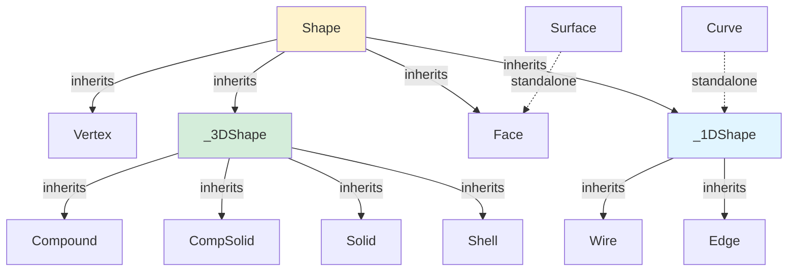

# Topology

Layer 2 — Shape hierarchy, casting, constructors, and functional APIs.



## Key Files

| File                | Purpose                                                                                                                                                                                                                                                                                                                                                                                                                                                      |
| ------------------- | ------------------------------------------------------------------------------------------------------------------------------------------------------------------------------------------------------------------------------------------------------------------------------------------------------------------------------------------------------------------------------------------------------------------------------------------------------------ |
| `shapes.ts`         | Full class hierarchy: `Shape<T>` base (clone, serialize, hashCode, transforms, edges/faces/wires, mesh, blobSTEP/STL), `Vertex` (asTuple), `Curve` (curveType, pointAt, tangentAt), `_1DShape` (Edge/Wire base with length, orientation, pointAt), `Edge`, `Wire` (offset2D), `Surface` (surfaceType), `Face` (UV, center, normalAt, outerWire, innerWires), `_3DShape` (fuse/cut/intersect/shell/fillet/chamfer), `Shell`, `Solid`, `CompSolid`, `Compound` |
| `cast.ts`           | `initCast()` for circular dep resolution, `asTopo()`, `iterTopo()` (hash-deduplicated), `shapeType()`, `downcast()`, `cast()` to proper Shape subclass                                                                                                                                                                                                                                                                                                       |
| `shapeFns.ts`       | Functional: `cloneShape`, `serializeShape`, `translateShape`, `rotateShape`, `mirrorShape`, `scaleShape`, `getEdges/Faces/Wires`, `getBounds`, `vertexPosition`                                                                                                                                                                                                                                                                                              |
| `curveFns.ts`       | Functional: `getCurveType`, `curveStartPoint/EndPoint`, `curvePointAt/TangentAt`, `curveLength`, `curveIsClosed/Periodic`, `getOrientation`, `flipOrientation`, `offsetWire2D`                                                                                                                                                                                                                                                                               |
| `faceFns.ts`        | Functional: `getSurfaceType`, `faceOrientation`, `flipFaceOrientation`, `uvBounds`, `pointOnSurface`, `uvCoordinates`, `normalAt`, `faceCenter`, `outerWire`, `innerWires`                                                                                                                                                                                                                                                                                   |
| `meshFns.ts`        | Functional: `meshShape` → ShapeMesh, `meshShapeEdges` → EdgeMesh, `exportSTEP/STL` → Result<Blob>                                                                                                                                                                                                                                                                                                                                                            |
| `booleanFns.ts`     | Functional: `fuseShape`, `cutShape`, `intersectShape`, `fuseAll`, `cutAll`, `buildCompound`                                                                                                                                                                                                                                                                                                                                                                  |
| `shapeBooleans.ts`  | Standalone boolean operations: `fuseAll`, `cutAll`, `buildCompound`, `applyGlue` — extracted from shapes.ts                                                                                                                                                                                                                                                                                                                                                  |
| `shapeModifiers.ts` | Modifier types and query infrastructure: `ChamferRadius`, `FilletRadius`, `RadiusConfig`, type guards, `getQueryModule`, `registerQueryModule` — extracted from shapes.ts, re-exported for backward compat                                                                                                                                                                                                                                                   |
| `primitiveFns.ts`   | Functional: `box`, `cylinder`, `sphere`, `cone`, `torus`, `ellipsoid` (→ `ValidSolid`), `line`, `circle`, `ellipse`, `helix`, `threePointArc`, `ellipseArc`, `bezier`, `bsplineApprox`, `tangentArc` (→ `Edge`), `wire`, `wireLoop` (→ `ClosedWire`), `face`, `filledFace`, `polygon` (→ `OrientedFace`), `solid` (→ `ValidSolid`), `vertex`, `compound`, `sewShells`, `offsetFace`, `addHoles`                                                              |
| `shapeHelpers.ts`   | Legacy OO constructors: makeLine, makeCircle, makeEllipse, makeHelix, makeThreePointArc, makeBSplineApproximation, makeBezierCurve, makeTangentArc, assembleWire, makeFace, makeNonPlanarFace, addHolesInFace, makeCylinder, makeSphere, makeEllipsoid, makeBox, compoundShapes, weldShellsAndFaces, makeSolid, makePolygon, makeOffset                                                                                                                      |

## Validity Types

`primitiveFns.ts` uses validity-branded return types to encode invariants at compile time:

- **`ValidSolid`** — returned by `box()`, `cylinder()`, `sphere()`, `cone()`, `torus()`, `ellipsoid()`, `solid()`
- **`ClosedWire`** — returned by `wireLoop()` (assembles edges and verifies closure)
- **`OrientedFace`** — returned by `face()`, `filledFace()`, `polygon()`, `subFace()`, `addHoles()`

Functions that need stronger guarantees require these branded types:

```typescript
face(w: ClosedWire): Result<OrientedFace>     // Won't accept a plain Wire
extrude(f: OrientedFace, h: number): ...      // Won't accept a plain Face
```

## Gotchas

1. **Dual API** — Class methods mutate (`shape.translate()`), functional API is immutable (`translateShape(shape, v)`). Prefer functional API for new code.
2. **Circular dependency** — `initCast()` must be called at module load to break shapes↔cast circular dependency
3. **Hash deduplication** — `iterTopo()` deduplicates via hash codes — same shape won't appear twice
4. **Boolean operations** — On classes return `Result<Shape3D>` — always handle errors
5. **Query dependency** — `fillet`/`chamfer`/`shell` require query module registration via `registerQueryModule()`
6. **Chainable transforms** — Shape transforms in class API return `this` (chainable but mutating)
7. **Flat mesh data** — `meshShape` returns flat typed arrays (Float32Array/Uint32Array) — not nested objects
8. **Consolidated types** — `ShapeMesh`, `FaceTriangulation`, `SurfaceType` are defined in functional files (`meshFns.ts`, `faceFns.ts`) and re-exported from `shapes.ts` for backward compatibility
9. **Never add new methods to class wrappers** — All new functionality goes in `*Fns.ts` files; the class-based wrappers in `shapes.ts` are legacy
